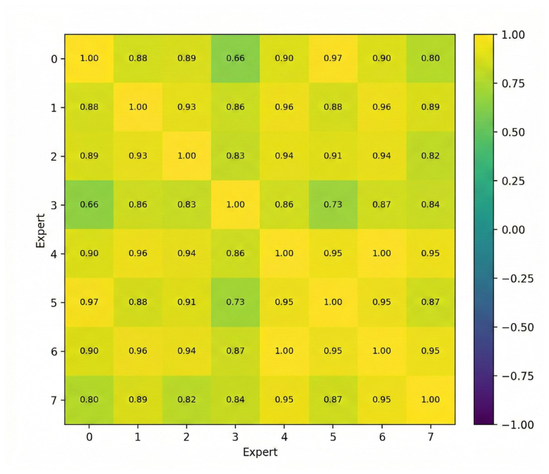
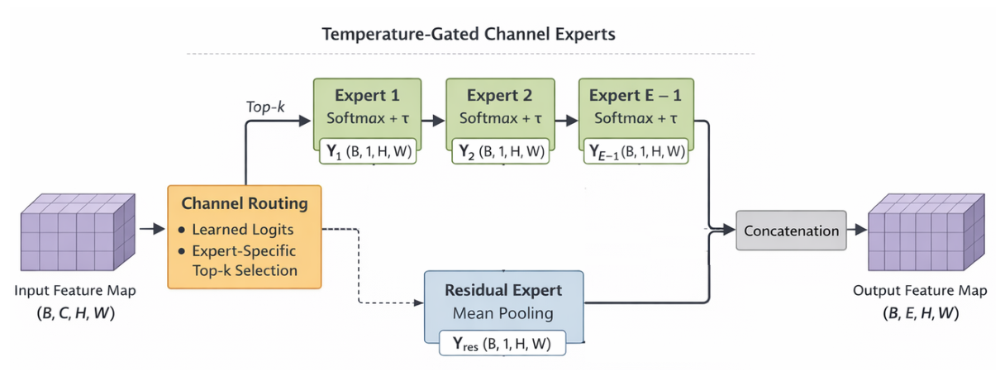

# MoCE — Mixture of Channel Experts

**Static Sparse Supports with Input-Adaptive Mixing for Pointwise Projections**

[](https://arxiv.org/abs/2608.23794)
[](https://aaai.org/)
[](https://pytorch.org/)
[](LICENSE)

Official implementation of **Mixture of Channel Experts (MoCE)** by
[Elian Iluk](mailto:elianroy.iluk@msmail.ariel.ac.il) and Gil Ben-Artzi,
School of Computer Science, Ariel University.

📄 **Paper:** [arXiv:2608.23794](https://arxiv.org/abs/2608.23794)

> MoCE replaces a dense pointwise (`1×1`) projection with a **structured sparse channel-mixing layer**.
> Each output channel is an *expert* that reads a learned, **static** top-`k` subset of the input channels
> (`k ≪ C`) and mixes them with a **convex softmax whose temperature is predicted per input**. A residual
> expert summarizes the unselected channels so coverage stays complete. The support is fixed at inference —
> no top-`k` search, no data-dependent branching — so the operator stays hardware-schedulable while cutting
> the projection's cost from quadratic in `C` to roughly `k/C`.

---

## Why MoCE

Copying the Mixture-of-Experts design directly into CNNs fails for a structural reason: parallel convolutional
experts that read the *same* input channels learn nearly identical filters (mean off-diagonal cosine similarity
of **0.88** in a ResNet-50 diagnostic). MoCE moves the expert axis from **operator duplication** to **channel
selection** — specialization comes from *which* channels each expert reads, not from independently parameterized
operators.

<p align="center">
  
  <br>
  <em>Parallel convolutional experts sharing an input (ResNet-50, CIFAR-100): pairwise kernel cosine similarity.</em>
</p>

- **Static, schedulable supports** — the selected channels are learned during training and frozen for inference.
- **Minimal input dependence** — a lightweight gate predicts one temperature per expert, moving each expert
  between mean-like and max-like aggregation without changing *which* channels it reads.
- **Complete coverage** — a residual expert aggregates channels no routed expert selected (on average only
  ~7.7% of channels remain uncovered before the residual).
- **Measured speedups** — the predicted MAC savings hold in real wall-clock time.

---

## Method

MoCE replaces a dense pointwise projection — `Y_o = Σ_c W_{o,c} X_c`, costing `C_in · C_out · H · W` MACs —
with `E − 1` **routed experts** over learned sparse supports plus **one residual expert**. Each routed expert
produces a single output channel from only `k ≪ C` input channels.

<p align="center">
  
  <br>
  <em>MoCE layer: E−1 temperature-gated routed experts over learned static supports, plus one residual aggregate.</em>
</p>

**1. Learn static supports.** Routing logits `L ∈ ℝ^{(E−1)×C}` assign each routed expert a preference vector.
Its support is the top-`k` channels it reads, `S_e = TopK(L_e, k)`. Gradients flow through the *values* of the
selected logits (and, via the coverage loss, through every logit), so supports can reorder during training — but
they are **precomputed and frozen at inference**. No top-`k` search, no data-dependent branching: the layer's
memory-access pattern is fixed and can be scheduled ahead of time.

**2. Predict a per-input temperature.** Global average pooling gives a descriptor `z = GAP(X)`. A small two-layer
gate, shared within a layer, emits one temperature `τ_e(X) = τ_min + (τ_max − τ_min)·σ(g(z))` per expert. The
temperature moves each expert between **mean-like** (large `τ` → uniform average over its support) and
**max-like** (small `τ` → mass on its top channel) aggregation — *without changing which channels it reads* or
their ordering.

**3. Convex mixing.** The selected logits, divided by the temperature, become softmax weights over the support:
`a_{e,i}(X) = softmax(L_{e,i} / τ_e(X))`, and the routed output is `Y_e = Σ_{i∈S_e} a_{e,i}(X) · X_i`. This is a
convex combination — strictly less expressive than an unconstrained projection, which is what makes it cheap and
schedulable.

**4. Residual coverage.** A residual expert averages every channel selected by *no* routed expert, so channel
coverage stays complete. On average only ~7.7% of channels remain uncovered before the residual folds them in.

**5. Load-balancing regularizer.** A coverage loss `L_cov` equalizes aggregate channel usage across experts,
supplying gradients to unselected logits so the hard supports keep improving during training.

**Cost & break-even.** The dominant per-layer work scales as ≈ `k/C` relative to the dense projection, so the
saving grows with input width. Because pooling and the residual read all channels, the measured **wall-clock**
speedup (up to ~3× on the deepest replaced projection) comes from shifting the operator into a
bandwidth-dominated regime, not from the MAC count alone.

---

## Results

### ImageNet-1K (ResNet backbones)

| Model         | Top-1 (%)      | MACs (G)          | Params (M, train / deploy) |
|---------------|:--------------:|:-----------------:|:--------------------------:|
| ResNet-50     | 75.98 ± 0.30   | 4.112             | 25.56                      |
| **+ MoCE**    | **76.71 ± 0.20** | **3.426** (−16.7%) | 25.55 / **21.26**         |
| ResNet-101    | 77.21 ± 0.29   | 7.834             | 44.55                      |
| **+ MoCE**    | **77.54 ± 0.19** | **6.288** (−19.7%) | 44.52 / **35.83**         |
| ResNet-152    | 77.78 ± 0.43   | 11.559            | 60.19                      |
| **+ MoCE**    | **78.24 ± 0.14** | **9.156** (−20.8%) | 60.15 / **47.84**         |

### CIFAR-100 (from scratch) & ImageNet→CIFAR transfer

| Model       | From scratch — C-100 | Transfer — C-100 |
|-------------|:--------------------:|:----------------:|
| ResNet-50   | 78.44 ± 32           | 85.44 ± 20       |
| **+ MoCE**  | **79.35 ± 35**       | **86.47 ± 27**   |

MoCE also transfers to **EfficientViT** (M2/M3/M5), where it replaces the second feed-forward projection and
reduces MACs by 18–22% while preserving accuracy. Across all backbones, sparse supports **preserve or improve**
accuracy at **17–21% fewer MACs**, with **17–21% smaller deployed parameter counts**.

---

## Quick start

```bash
# 1. Clone
git clone https://github.com/Elianiluk/MoCE_thesis.git
cd MoCE_thesis

# 2. Environment (PyTorch 2.x + CUDA)
pip install -r requirements.txt

# 3. (Optional) build the fused CUDA kernel for fast inference
cd moce_fixed && pip install -e . && cd ..
```

**CIFAR-100** — train ResNet-50 + MoCE across 2 GPUs (`run_cifar.sh`):

```bash
bash run_cifar.sh
```

which runs, per experiment:

```bash
CUDA_VISIBLE_DEVICES=0,1 torchrun --nproc_per_node=2 --master_port=55624 test.py \
  --lr 0.05 --dataset cifar100 --model moce50 --amp --run-name "moce_final#1" --k 8
```

**ImageNet-1K** — `run_imagenet.sh` is a **SLURM batch script** (1 node × 8 GPUs, mixed
precision, cosine schedule with 5-epoch warmup, and automatic resume-from-checkpoint on
failure). Every hyperparameter is overridable through environment variables:

```bash
# Submit with defaults
sbatch run_imagenet.sh

# Or override any hyperparameter at submit time
MODEL=moce50 EPOCHS=120 LR=0.1 BATCH_SIZE_PER_GPU=64 sbatch run_imagenet.sh
```

Not on a SLURM cluster? Launch the same training directly with `torchrun`:

```bash
torchrun --nproc_per_node=8 test.py \
  --dataset imagenet --imagenet-root /path/to/imagenet \
  --model moce50 --epochs 120 --batch-size 512 --lr 0.1 --amp \
  --warmup-epochs 5 --run-name "moce_imagenet"
```

Train the matching **dense baseline** for comparison by swapping `--model baseline50`.

---

## Models

| `--model`     | Backbone                  | Replaced projection                                |
|---------------|---------------------------|----------------------------------------------------|
| `baseline50`  | ResNet-50 (dense)         | —                                                  |
| `baseline101` | ResNet-101 (dense)        | —                                                  |
| `baseline152` | ResNet-152 (dense)        | —                                                  |
| `moce50`      | ResNet-50 + MoCE          | Bottleneck entrance `1×1` projections              |
| `moce101`     | ResNet-101 + MoCE         | Bottleneck entrance `1×1` projections              |
| `moce152`     | ResNet-152 + MoCE         | Bottleneck entrance `1×1` projections              |

Datasets: `--dataset cifar100` (from scratch) or `--dataset imagenet` (with `--imagenet-root`).

---

## CLI flags

```
--model                       Model variant: baseline50/101/152, moce50/101/152 (default: moce50)
--dataset                     cifar100 | imagenet (default: cifar100)
--cifar-root                  CIFAR-100 root directory (default: /data)
--imagenet-root               ImageNet root with train/ and val/ (default: /data/imagenet)
--run-name                    Experiment run name (required)

--k                           Number of selected channels per expert (support size) (default: 8)
--k-config                    Per-stage / per-block k override (default: none)

--epochs                      Training epochs (default: 200)
--batch-size                  Total batch size (default: 196)
--lr                          Base learning rate (default: 0.1)
--momentum                    SGD momentum (default: 0.9)
--weight-decay                Weight decay (default: 5e-4)
--router-lr-mult              LR multiplier for router parameter group (default: 1)
--amp                         Enable mixed-precision training

--scheduler                   auto | cosine | step (default: auto)
--warmup-epochs               Linear warmup epochs (auto: 0 CIFAR, 5 ImageNet)
--warmup-start-factor         Warmup starting LR multiplier (default: 0.1)
--min-lr                      Minimum LR for cosine (default: 0.0)
--step-size / --gamma         StepLR schedule params (defaults: 30 / 0.1)

--moce-balance-weight         MoCE balance (coverage) loss weight (default: 0.05)
--moce-specialization-weight  MoCE specialization loss weight (default: 0.1)
--moce-diversity-weight       MoCE diversity loss weight (default: 0.01)
--num-workers                 DataLoader workers (default: 4)
```

---

## Repository structure

```
MoCE_thesis/
├── test.py              # Main training / evaluation entry point (DDP via torchrun)
├── MoCE.py              # The MoCE layer: static supports, temperature gate, residual expert
├── models_unified.py    # ResNet-50/101/152 backbones with MoCE-replaced projections
├── moce_fixed/          # Fused CUDA kernel for packed, static-support inference
├── run_cifar.sh         # CIFAR-100 launch script (2-GPU torchrun)
├── run_imagenet.sh      # ImageNet-1K SLURM batch script (8-GPU, env-overridable, auto-resume)
├── requirements.txt     # Python dependencies
├── assets/              # Figures used in this README
└── README.md
```

---

## Citation

If you use MoCE in your research, please cite:

```bibtex
@article{iluk2026moce,
  title         = {Mixture of Channel Experts: Static Sparse Supports with
                   Input-Adaptive Mixing for Pointwise Projections},
  author        = {Iluk, Elian and Ben-Artzi, Gil},
  journal       = {arXiv preprint arXiv:2608.23794},
  year          = {2026},
  eprint        = {2608.23794},
  archivePrefix = {arXiv},
  primaryClass  = {cs.CV}
}
```

---

## Contact

Questions and issues are welcome via [GitHub Issues](https://github.com/Elianiluk/MoCE_thesis/issues)
or by email: `elianroy.iluk@msmail.ariel.ac.il`.
